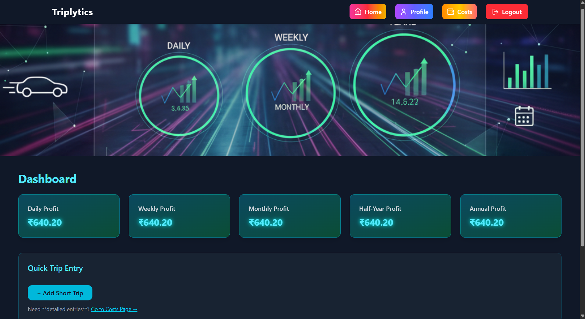
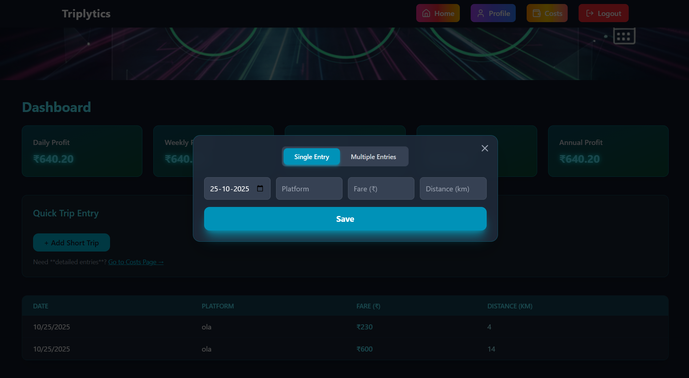
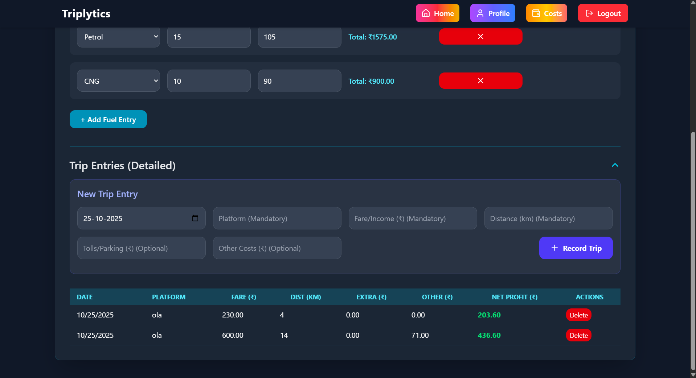
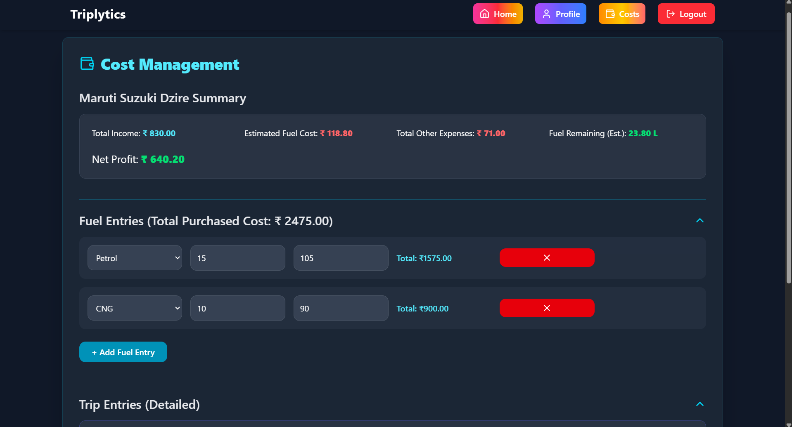
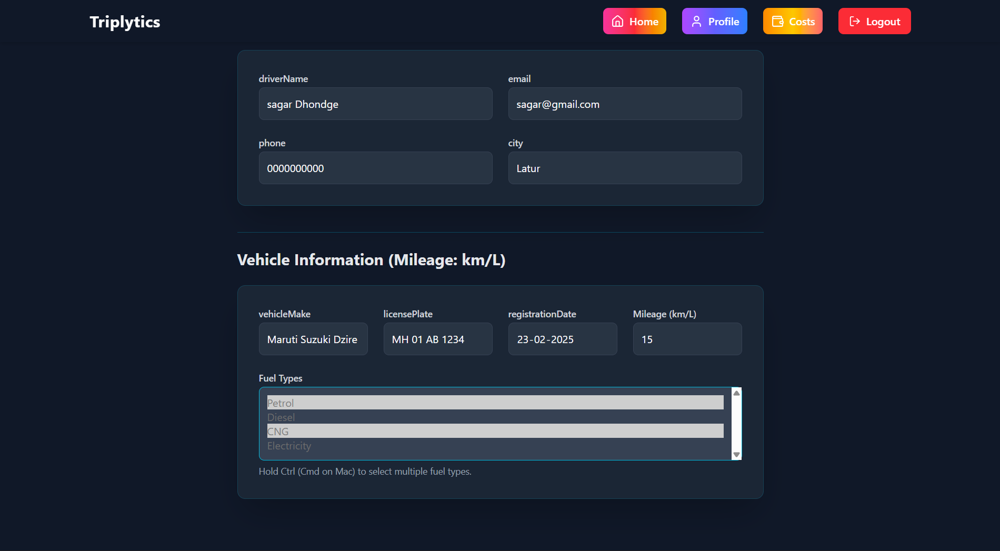
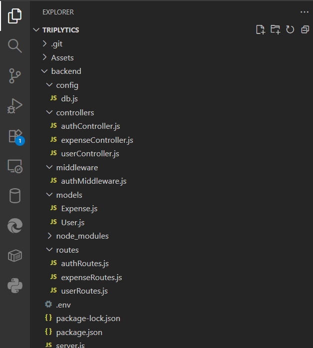
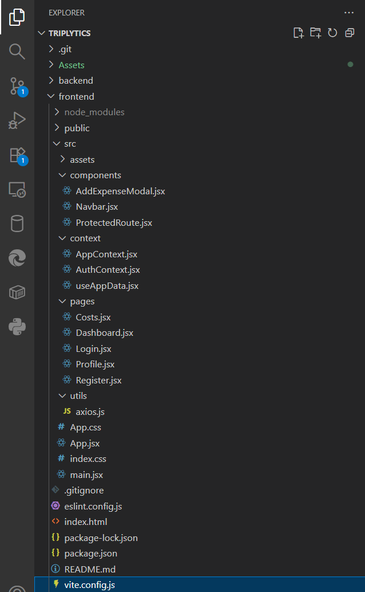

# 🚗 Triplytics

Triplytics is a **Cab Driver Expense & Trip Management App** built using the **MERN stack** — MongoDB, Express, React, and Node.js.  
It helps cab drivers and vehicle owners **track their trips, manage expenses, and monitor vehicles** with an intuitive dashboard and analytics.

---

## 🌟 Features

- 🔐 **Secure Authentication** — User registration & login with JWT
- 🚘 **Vehicle Management** — Add, edit, and view registered vehicles
- 💸 **Expense Tracking** — Log, edit, and categorize your daily trip expenses
- 📊 **Dashboard Overview** — Get a clear picture of your trips and spending
- 👤 **Profile Management** — View and update user profile details
- ☁️ **Cloud Database** — Powered by MongoDB Atlas
- 📱 **Fully Responsive Design** — Works on desktop, tablet, and mobile

---

## 🖼️ App Screenshots

### 🔑 Login & Register
| Login | Register |
|:--:|:--:|
|  |  |

### 🏠 Dashboard


### ✏️ Dashboard Entry


### 🚘 Trip Page


### 💰 Costs / Expenses


### 👤 Profile Page


---

## ⚙️ Tech Stack

| Area | Technology |
|------|-------------|
| Frontend | React (Vite), Axios, Context API |
| Backend | Node.js, Express |
| Database | MongoDB Compass |
| Authentication | JWT (JSON Web Token) |

---

## 🛠️ Installation & Setup

To get Triplytics up and running on your local machine, follow these steps:

### 🔹 Project Structure

Here is a visual representation of the project structure for both the backend (Express/Node.js) and frontend (React/Vite) directories:

| Backend Structure |
|:--:|
|  |
|:--:|
| Frontend Structure |
| |

---

### 🔹 Clone the repository
```bash
git clone [https://github.com/sagardhondge/Triplytics](https://github.com/sagardhondge/Triplytics)
cd triplytics

🔹 Backend Setup
cd backend
npm install
npm run dev


Create a .env file inside /backend with:

MONGO_URI=your_mongodb_atlas_uri
JWT_SECRET=your_secret_key
PORT=5000

🔹 Frontend Setup
cd frontend
npm install
npm run dev

---

🧑‍💻 Author

Sagar Dhondge
sagardhondge56@gmail.com

